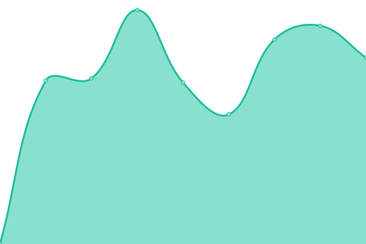

# [📈 Live Status](https://moveDaniel.github.io/uptime): <!--live status--> **🟧 Partial outage**

This repository contains the open-source uptime monitor and status page for [moveDaniel](https://moveDaniel.github.io/uptime), powered by [Upptime](https://github.com/upptime/upptime).

With [Upptime](https://upptime.js.org), you can get your own unlimited and free uptime monitor and status page, powered entirely by a GitHub repository. We use [Issues](https://github.com/moveDaniel/uptime/issues) as incident reports, [Actions](https://github.com/moveDaniel/uptime/actions) as uptime monitors, and [Pages](https://moveDaniel.github.io/uptime) for the status page.

<!--start: status pages-->
<!-- This summary is generated by Upptime (https://github.com/upptime/upptime) -->
<!-- Do not edit this manually, your changes will be overwritten -->
<!-- prettier-ignore -->
| URL | Status | History | Response Time | Uptime |
| --- | ------ | ------- | ------------- | ------ |
|  [Website](https://www.move-elevator.de) | 🟩 Up | [website.yml](https://github.com/moveDaniel/uptime/commits/HEAD/history/website.yml) | 

 907ms
     
 | 

<a href="https://moveDaniel.github.io/uptime/history/website">100.00%</a>
    

|  [Wiki](https://move-elevator.atlassian.net/) | 🟩 Up | [wiki.yml](https://github.com/moveDaniel/uptime/commits/HEAD/history/wiki.yml) | 

 435ms
     
 | 

<a href="https://moveDaniel.github.io/uptime/history/wiki">100.00%</a>
    

|  [Jira](https://jira.move-elevator.de) | 🟥 Down | [jira.yml](https://github.com/moveDaniel/uptime/commits/HEAD/history/jira.yml) | 

 706ms
     
 | 

<a href="https://moveDaniel.github.io/uptime/history/jira">30.27%</a>
    

|  [VPN OB](89.27.147.5) | 🟩 Up | [vpn-ob.yml](https://github.com/moveDaniel/uptime/commits/HEAD/history/vpn-ob.yml) | 

 110ms
     
 | 

<a href="https://moveDaniel.github.io/uptime/history/vpn-ob">99.57%</a>
    

|  [VPN DD](212.202.128.19) | 🟩 Up | [vpn-dd.yml](https://github.com/moveDaniel/uptime/commits/HEAD/history/vpn-dd.yml) | 

 128ms
     
 | 

<a href="https://moveDaniel.github.io/uptime/history/vpn-dd">100.00%</a>
    

<!--end: status pages-->

[**Visit our status website →**](https://moveDaniel.github.io/uptime)

## 📄 License

- Powered by: [Upptime](https://github.com/upptime/upptime)
- Code: [MIT](./LICENSE) © [Anand Chowdhary](https://anandchowdhary.com), supported by [Pabio](https://pabio.com)
- Data in the `./history` directory: [Open Database License](https://opendatacommons.org/licenses/odbl/1-0/)
